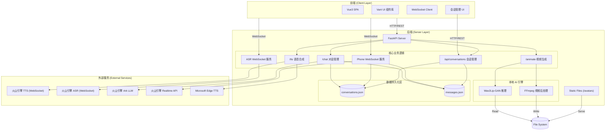
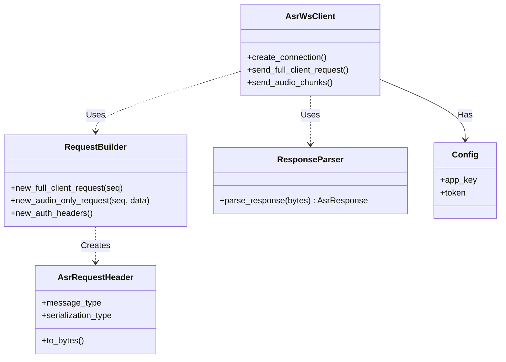
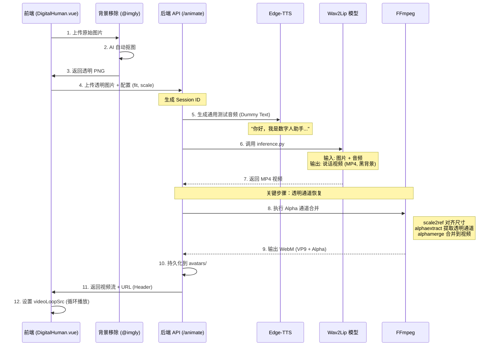
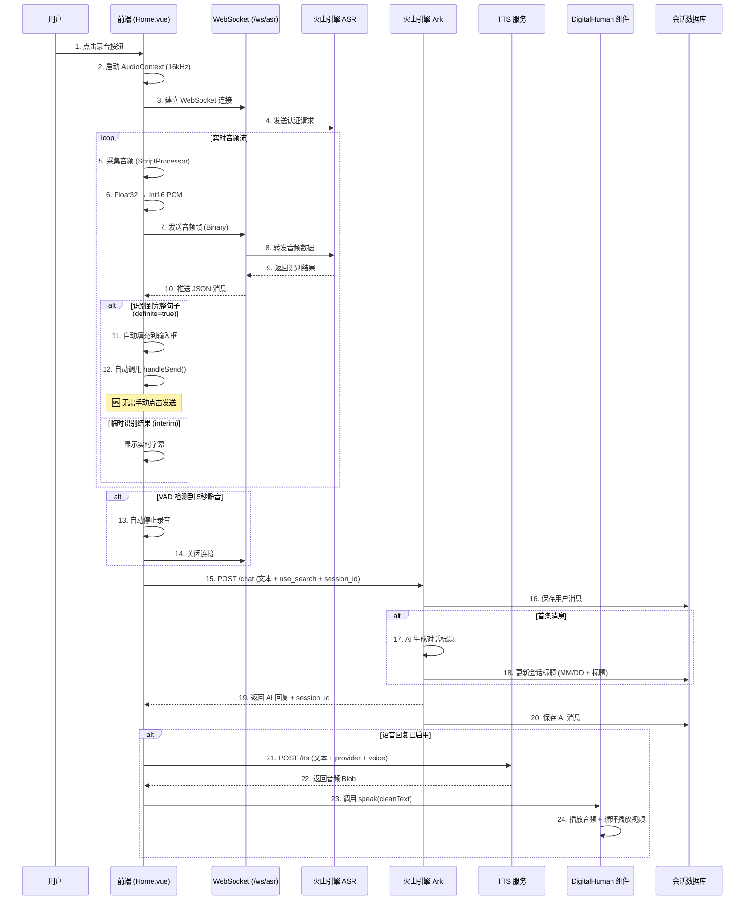
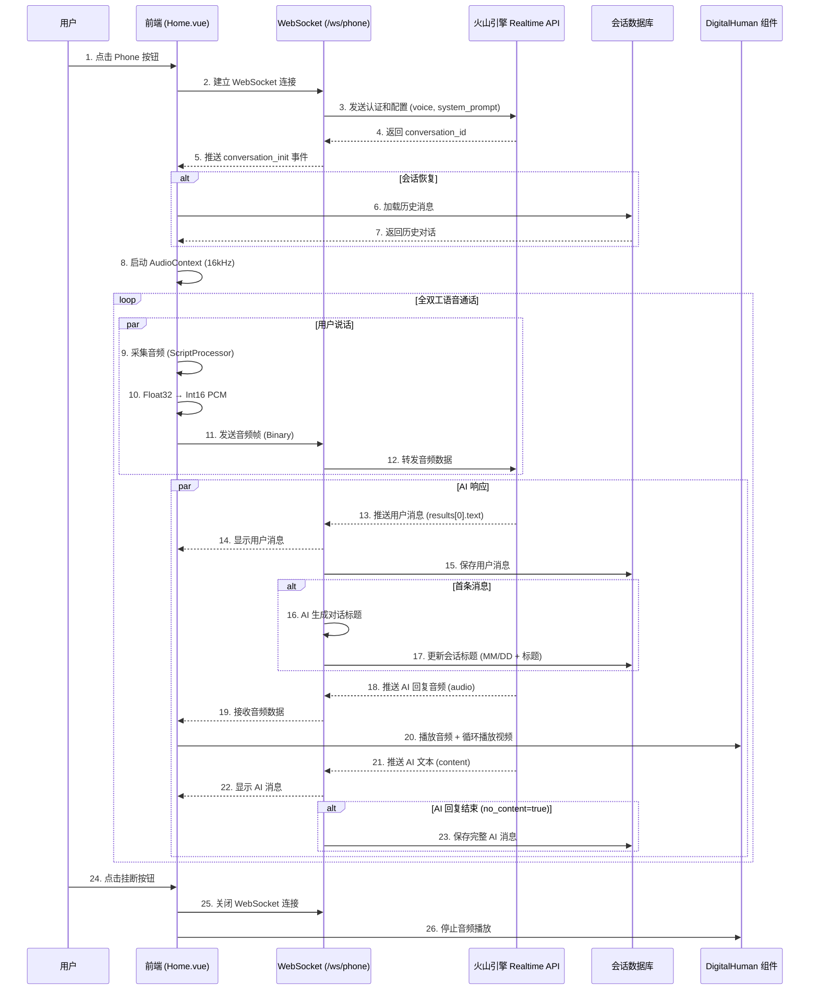

# 数字人助手 (Digital Human Assistant)

<div align="center">

[](https://opensource.org/licenses/MIT)
[](https://www.python.org/downloads/)
[](https://vuejs.org/)
[](https://fastapi.tiangolo.com/)

**AI 数字人对话系统 | 实时语音交互 | 会话管理**

</div>

---

这是一个基于 **Wav2Lip**、**Edge-TTS** (微软语音) 和 **Volcengine** (火山引擎) 的数字人对话系统。包含 Vue3 前端和 FastAPI 后端，支持生成带有透明背景的数字人视频，并实现实时语音对话交互。

## 🌟 项目特色

- 🎭 **透明背景数字人** - 完美融入任何 UI 界面
- 🎤 **多模态对话** - 支持文字、语音识别、实时语音三种交互方式
- 💬 **智能会话管理** - 类似 ChatGPT 的对话历史管理
- 🎵 **多音色支持** - Edge TTS + 火山引擎精品音色
- ⚡ **实时响应** - WebSocket 全双工通信
- 🔒 **安全可靠** - 密钥配置分离，开源安全

## 📝 更新日志

### v2.0.0 (2026-02-09) - 会话管理系统

**🎉 重大更新**
- ✨ **会话管理系统**：实现类似 ChatGPT 的完整会话管理功能
  - AI 自动生成对话标题（带日期前缀，格式：MM/DD + 标题）
  - 左侧边栏显示所有历史对话，支持快速切换
  - 所有对话消息自动持久化保存
  - 支持选择已有对话继续聊天，保持上下文连贯
  - 普通聊天和 Phone 模式均支持会话管理

**🔧 功能优化**
- 🎤 **Phone 模式增强**：
  - 修复消息保存逻辑，解决字符逐个保存问题
  - 优化事件结构匹配 Volcengine Realtime API
  - 支持会话历史加载和恢复
  - 新建对话功能正常工作
- 🎵 **音色配置同步**：
  - 修复 Phone 音色选择不生效问题
  - 后台切换音色立即同步到前台
  - 支持独立配置实时对话专用音色

**🐛 Bug 修复**
- 修复聊天记录未保存问题
- 修复 Phone 模式加载旧对话问题
- 修复"+"按钮不创建新对话问题
- 修复后台音色切换无反应问题

**📚 文档更新**
- 更新 API 接口文档，添加会话管理相关接口
- 更新系统架构图，添加会话管理模块和数据持久化层
- 更新实时语音对话流程图，包含会话管理流程
- 更新技术栈说明

---

## ✨ 核心功能

- **📸 照片转数字人**：上传静态人像照片，自动抠图并生成透明背景的说话视频素材
- **🎭 透明背景**：深度优化 FFmpeg 处理流程，生成带有 Alpha 通道的 WebM 视频，完美融入 UI 背景
- **🎬 视频驱动**：使用 Wav2Lip 生成通用说话视频，播放音频时循环播放视频营造说话效果
- **🎤 多模态 TTS**：
    - **Microsoft Edge TTS**：免费、无需 Key，支持多种中英文音色
    - **火山引擎 BigTTS**：支持情感更丰富的精品音色（如"魅力女友"、"少年梓辛"等）
    - **🆕 实时对话音色**：Phone 模式支持独立配置实时对话专用音色
- **⚙️ 个性化设置**：
    - **缩放控制**：支持滑块拖拽与数值手动输入（步进 0.05x），精确调整人物大小
    - **显示模式**：支持"全身 (Cover)"和"半身 (Contain)"两种显示模式
    - **配置记忆**：自动记录每个数字人形象的缩放比例和显示设置，切换形象时自动还原
- **🤖 智能对话**：集成 LLM（火山引擎 Ark），支持多种对话模式
  - **文字聊天**：支持文本输入，AI 自动回复
  - **语音识别对话**（ASR 模式）：
    - 语音自动发送：识别到完整句子自动发送，无需手动点击
    - VAD 静音检测：5秒无声自动停止录音
    - 重复过滤：智能去重，防止 ASR 延迟导致的重复发送
  - **🆕 Phone 实时对话**：基于火山引擎 Realtime API 的全双工语音对话
    - 实时语音交互：边说边听，自然流畅的对话体验
    - 独立音色配置：支持专门的实时对话音色
    - 自动会话管理：对话内容自动保存和恢复
- **💬 会话管理系统** (类似 ChatGPT)：
  - **🆕 智能标题生成**：AI 自动分析对话内容生成简洁标题（带日期前缀）
  - **🆕 会话列表**：左侧边栏显示所有历史对话，支持快速切换
  - **🆕 消息持久化**：所有对话消息自动保存，支持随时查看历史记录
  - **🆕 会话恢复**：可选择已有对话继续聊天，保持上下文连贯
  - **🆕 多模式支持**：普通聊天和 Phone 模式均支持会话管理
- **📚 历史记录**：自动缓存已生成的形象，支持一键切换和管理

## 📁 项目结构

```
数字人前端/
├── backend/                    # Python 后端服务
│   ├── main.py                # FastAPI 主入口 (API 路由、FFmpeg 处理、会话管理)
│   ├── volc_tts.py            # 火山引擎 TTS 实现 (WebSocket)
│   ├── volc_asr.py            # 火山引擎 ASR 语音识别 (WebSocket)
│   ├── volc_realtime.py       # 火山引擎 Realtime API 实现 (Phone 模式)
│   ├── volc_protocol.py       # 火山引擎协议封装 (TTS/ASR)
│   ├── volc_realtime_protocol.py  # 火山引擎 Realtime 协议封装
│   ├── llm.py                 # 大模型调用封装 (火山引擎 Ark)
│   ├── conversations.json     # 会话列表数据 (自动生成)
│   ├── messages.json          # 消息记录数据 (自动生成)
│   ├── Wav2Lip/               # Wav2Lip 唇形同步模型
│   │   └── inference.py       # 推理脚本
│   ├── checkpoints/           # 模型权重文件 (wav2lip_gan.pth)
│   ├── ffmpeg/                # FFmpeg 工具 (Windows x64)
│   └── avatars/               # 生成的数字人视频存储 (持久化)
│
├── src/                       # Vue3 前端源码
│   ├── views/
│   │   ├── Home.vue          # 主页 - 聊天界面
│   │   └── Admin.vue         # 管理页 - 形象管理、参数配置
│   ├── components/
│   │   └── DigitalHuman.vue  # 数字人核心组件 (视频播放、音频同步)
│   ├── App.vue               # 应用根组件 (路由容器)
│   └── main.ts               # 应用入口
│
├── dist/                      # 前端构建产物 (npm run build)
├── deploy/                    # 部署包目录 (make_package.py 生成)
├── pyproject.toml             # Python 项目配置 (uv 管理)
├── package.json               # Node.js 项目配置
├── secrets.json               # 密钥配置文件 (需自行创建)
├── secrets.json.example       # 密钥配置模板
└── README.md                  # 项目文档
```

## 🚀 快速开始

### 1. 环境要求

- **Python**: 3.8+
- **Node.js**: 16+
- **FFmpeg**: 已内置 Windows 版本，其他系统需自行安装

### 2. 配置密钥

项目需要配置火山引擎的 API 密钥才能正常运行。

#### 步骤 1: 复制配置模板

```bash
cp secrets.json.example secrets.json
```

#### 步骤 2: 获取 API 密钥

1. **火山引擎 TTS/ASR/Realtime**
   - 访问 [火山引擎控制台](https://console.volcengine.com/)
   - 开通语音合成（TTS）、语音识别（ASR）、实时对话（Realtime）服务
   - 获取 `APPID` 和 `ACCESS_TOKEN`

2. **火山引擎 Ark (LLM)**
   - 访问 [火山引擎 Ark 平台](https://console.volcengine.com/ark)
   - 创建 API Key
   - 获取 `ARK_API_KEY`

#### 步骤 3: 填写配置文件

编辑 `secrets.json`，填入你的密钥：

```json
{
    "VOLC_TTS_APPID": "你的火山引擎 APP ID",
    "VOLC_TTS_TOKEN": "你的火山引擎 ACCESS TOKEN",
    "VOLC_TTS_CLUSTER": "volcano_tts",

    "VOLC_ASR_APPID": "你的火山引擎 APP ID",
    "VOLC_ASR_TOKEN": "你的火山引擎 ACCESS TOKEN",
    "VOLC_ASR_CLUSTER": "volcengine_streaming_common",
    "VOLC_ASR_RESOURCE_ID": "volc.bigasr.sauc.duration",

    "VOLC_REALTIME_APPID": "你的火山引擎 APP ID",
    "VOLC_REALTIME_TOKEN": "你的火山引擎 ACCESS TOKEN",
    "VOLC_REALTIME_RESOURCE_ID": "volc.speech.dialog",

    "VOLC_URL": "wss://openspeech.bytedance.com/api/v3/sauc/bigmodel",

    "ARK_API_KEY": "你的 ARK API KEY"
}
```

> **注意**: `secrets.json` 已被添加到 `.gitignore`，不会被提交到 Git 仓库。

### 3. 安装依赖

#### 后端依赖

```bash
# 使用 uv (推荐)
uv sync

# 或使用 pip
pip install -r backend/requirements.txt
```

#### 前端依赖

```bash
npm install
```

### 4. 下载模型

下载 Wav2Lip 模型权重文件并放置到 `backend/checkpoints/` 目录：

- [wav2lip_gan.pth](https://github.com/Rudrabha/Wav2Lip/releases)

### 5. 启动服务

#### Windows

```bash
start_windows.bat
```

#### Linux/Mac

```bash
# 后端
cd backend
python main.py

# 前端 (新终端)
npm run dev
```

### 6. 访问应用

打开浏览器访问: `http://localhost:5173`

## 🏗️ 技术架构

### 后端 API 接口

后端使用 **FastAPI** 框架，运行在 `8004` 端口。

| 方法 | 路径 | 功能描述 | 参数说明 | 返回值 |
| :--- | :--- | :--- | :--- | :--- |
| `POST` | `/animate` | 生成数字人视频 | `image`: 图片文件<br>`avatar_fit`: 显示模式<br>`avatar_scale`: 缩放比例 | `.webm` 视频文件 |
| `POST` | `/tts` | 文本转语音 | `text`: 文本<br>`voice`: 音色ID<br>`tts_provider`: `edge`/`volcengine` | `.mp3` 音频文件 |
| `POST` | `/chat` | LLM 对话 | `text`: 用户输入<br>`use_search`: 是否联网<br>`session_id`: 会话ID (可选) | `{"text": "AI回答", "session_id": "会话ID"}` |
| `GET` | `/history` | 获取历史形象列表 | 无 | JSON 数组 (含元数据) |
| `PUT` | `/history` | 保存形象设置 | `url`: 视频URL<br>`meta`: 配置对象 | JSON 状态 |
| `WS` | `/ws/asr` | 实时语音识别 | WebSocket 音频流 | 实时文本 JSON |
| `WS` | `/ws/phone` | Phone 实时对话 | WebSocket 音频流 | 实时语音+文本 JSON |
| `GET` | `/api/conversations` | 获取会话列表 | 无 | JSON 数组 (会话列表) |
| `GET` | `/api/conversations/{id}/messages` | 获取会话消息 | `id`: 会话ID | JSON 数组 (消息列表) |
| `DELETE` | `/api/conversations/{id}` | 删除会话 | `id`: 会话ID | JSON 状态 |

### 技术栈

**后端技术**
- **FastAPI** - 高性能异步 Web 框架
- **Wav2Lip** - 唇形同步深度学习模型
- **PyTorch** - 深度学习框架
- **FFmpeg** - 视频处理工具
- **Edge-TTS** - 微软语音合成
- **火山引擎** - TTS/ASR/LLM/Realtime API 服务
- **JSON 文件存储** - 会话和消息持久化

**前端技术**
- **Vue 3** - 渐进式 JavaScript 框架
- **Vite** - 下一代前端构建工具
- **Vant UI** - 移动端组件库
- **Tailwind CSS** - 原子化 CSS 框架
- **TypeScript** - 类型安全的 JavaScript

## 🎨 设计规范

### UI 设计风格
- **设计语言**：拟物化 + 现代扁平，模仿 iPhone 界面
- **配色方案**：
  - 背景色：`bg-gray-900` (深色沉浸式)
  - 容器色：极光渐变 (`from-pink-50 via-purple-50 to-blue-50`)
  - 强调色：`blue-500` / `indigo-600`
- **圆角体系**：
  - 卡片/面板：`rounded-[18px]` ~ `rounded-[24px]`
  - 按钮：`rounded-[16px]`
  - 外框容器：`rounded-[48px]` (模拟 iPhone 边框)
- **交互状态**：Hover/Active/Focus/Disabled 全覆盖
- **网格系统**：严格遵循 8px 栅格原则

### 开发规范
- **前端**：Vue 3 Composition API + TypeScript + Tailwind CSS
- **后端**：FastAPI + AsyncIO + Pydantic 数据校验
- **API 设计**：RESTful 风格 + WebSocket 实时通信
- **错误处理**：统一异常捕获 + 用户友好提示

## 系统设计与架构视图 (System Design)

为了帮助开发人员全面理解系统，以下提供核心架构视图。

### 1. 系统架构图 (System Architecture)

展示了系统各组件的层次关系及外部依赖。



### 2. 核心类图 (Class Diagram - Volcengine ASR)

本项目中 `backend/volc_asr.py` 实现了复杂的二进制 WebSocket 协议，以下是其类设计图。



### 3. 核心业务流程详解

#### 3.1 数字人视频生成流程 (异步处理)

此流程负责将静态图片转换为带有透明背景的**通用说话视频素材**。

**重要说明**：本项目采用**视频循环播放**方案，而非实时唇形同步。具体来说：
- 上传图片后，使用 Wav2Lip 生成一段通用的"说话视频"（约3-5秒）
- 前端播放音频时，同步循环播放这段视频，营造"在说话"的视觉效果
- 这种方案比实时唇形同步更轻量，但牺牲了口型与语音的精确对齐



**关键代码逻辑 (`backend/main.py`)**:

FFmpeg 命令的构建非常关键，必须严格遵循以下顺序以防止 `Invalid argument` 错误：

```python
# 1. 强制图片尺寸为偶数 (VP9 编码器要求宽高必须为偶数)
# 2. 使用 scale2ref 将 Wav2Lip 生成的视频强制缩放到图片的尺寸 (解决 1px 误差)
# 3. 提取原图 Alpha 通道并合并到视频中
cmd = [
    FFMPEG_PATH, "-y", 
    "-i", output_video_path,        # Input 0: Wav2Lip 视频 (MP4, 无透明)
    "-loop", "1", "-i", image_path, # Input 1: 原始图片 (PNG, 有透明)
    "-filter_complex", 
    "[1:v]scale=trunc(iw/2)*2:trunc(ih/2)*2[img_even];" # 修复奇数尺寸
    "[0:v][img_even]scale2ref[vid_scaled][img_ref];"    # 对齐尺寸
    "[img_ref]format=rgba,alphaextract[alpha];[vid_scaled]format=rgba[vid];[vid][alpha]alphamerge", # 合并 Alpha
    "-c:v", "libvpx-vp9",           # 编码器: VP9 (WebM)
    "-pix_fmt", "yuva420p",         # 像素格式: 带 Alpha
    final_output_path
]
```

#### 3.2 语音转文字对话流程 (ASR 模式)

此流程展示类似微信的语音转文字功能，用户录音后自动识别为文字并发送。

**核心特性**：
- ✅ **智能语音自动发送**：识别到完整句子 (definite) 时自动发送，无需手动点击
- ✅ **重复过滤**：防止 ASR 延迟导致的重复发送
- ✅ **VAD 静音检测**：5秒无声自动停止录音并发送
- ✅ **会话管理**：所有对话自动保存，支持历史记录查看和恢复
- ✅ **AI 标题生成**：自动为对话生成简洁标题（带日期前缀）



#### 3.3 Phone 实时对话流程

此流程展示 Phone 模式的全双工语音对话，基于火山引擎 Realtime API。

**核心特性**：
- ✅ **全双工通信**：用户可以随时打断 AI 说话
- ✅ **实时语音交互**：边说边听，自然流畅
- ✅ **自动会话管理**：对话内容自动保存
- ✅ **独立音色配置**：支持专门的实时对话音色



### 4. 前端组件交互逻辑

#### 4.1 UI 设计风格与配色系统 (Design System)

本项目采用 **拟物化 (Skeuomorphism)** 与 **现代扁平 (Flat Modern)** 相结合的风格，模仿 iPhone 界面，旨在提供沉浸式的移动端体验。

**核心配色方案 (Tailwind CSS)**:
*   **背景色**: `bg-gray-900` (深色沉浸式底座)
*   **容器色**: `bg-gradient-to-br from-pink-50 via-purple-50 to-blue-50` (柔和的极光渐变，模拟手机屏幕光感)
*   **强调色 (Primary)**:
    *   `blue-500` (#3b82f6): 按钮、激活状态、用户气泡
    *   `indigo-600` (#4f46e5): 渐变终点、深色强调
*   **功能色**:
    *   `red-500`: 录音/停止状态
    *   `slate-400`: 次要文本、未激活图标

**设计规范与交互原则 (Design Guidelines)**:
*   **网格系统 (8px Spacing System)**: 严格遵循 8px 栅格原则，所有间距 (`margin`, `padding`) 均为 8 的倍数（Tailwind 中的 `p-2`, `m-4` 等），保证视觉韵律的统一性。
*   **圆角体系 (Corner Radius)**:
    *   **卡片/面板**: `rounded-[18px]` ~ `rounded-[24px]` (大圆角，亲和力强)
    *   **按钮/交互项**: `rounded-[16px]` (Squircle 超椭圆风格)
    *   **外框容器**: `rounded-[48px]` (拟合 iPhone 物理边框)
*   **交互状态 (Interactive States)**:
    *   **常规态 (Default)**: 清晰明确，符合直觉。
    *   **悬停态 (Hover)**: 微动效 (`transform: scale(1.02)`) 或 亮度提升 (`brightness-110`)。
    *   **点击态 (Active)**: 按压回馈 (`scale-95`)，模拟物理按键质感。
    *   **聚焦态 (Focus)**: 环形光晕 (`ring-2 ring-offset-2`)，支持键盘导航。
    *   **禁用态 (Disabled)**: 透明度降低 (`opacity-50`)，鼠标指针变更 (`cursor-not-allowed`)。
    *   **加载态 (Loading)**: 骨架屏 (Skeleton) 或 局部 Spinner，避免全屏遮罩。
    *   **空状态 (Empty)**: 情感化插画 + 引导性文案。
    *   **错误态 (Error)**: 红色脉冲 (`animate-pulse`) + 清晰的错误提示。
*   **字体排印 (Typography)**:
    *   **字体栈**: 优先使用系统默认无衬线字体 (`system-ui`, `-apple-system`, `BlinkMacSystemFont`)，确保跨平台渲染一致性。
    *   **层级 (Hierarchy)**:
        *   Heading 1: `text-xl font-bold` (主要标题)
        *   Heading 2: `text-lg font-semibold` (模块标题)
        *   Body: `text-[15px] leading-relaxed` (正文，优化阅读体验)
        *   Caption: `text-xs text-slate-400` (辅助说明)
*   **用户体验标准 (UX Standards)**:
    *   **即时反馈**: 所有操作在 100ms 内给出视觉反馈。
    *   **容错性**: 允许撤销关键操作（如删除历史记录）。
    *   **一致性**: 保持按钮位置、颜色语义在全局的一致性。
    *   **可访问性 (Accessibility/a11y)**:
        *   所有交互元素强制包含 `aria-label` 属性。
        *   确保文字与背景对比度符合 WCAG AA 标准。
        *   支持键盘导航焦点状态。

**关键 UI 组件**:
*   **手机仿真容器**: 使用 `rounded-[48px]` 和 `border-[8px]` 模拟 iPhone 边框与灵动岛区域。
*   **毛玻璃效果**: 大量使用 `backdrop-blur-xl` 和 `bg-white/x` 实现 iOS 风格的半透明层级。
*   **Macaron 语音面板**: 录音时弹出的全屏覆盖层，使用高饱和度的糖果色圆环动画 (`animate-ping`)。

#### 4.2 核心逻辑处理 (Frontend Logic)

前端主要由 `Home.vue` (主界面)、`Admin.vue` (管理面板) 和 `DigitalHuman.vue` (数字人组件) 组成。

- **`Home.vue` (主页 - 聊天界面)**:
    - **职责**: 处理用户交互、消息显示、会话管理。
    - **对话模式**:
        - **文字聊天**: 文本输入框 + 发送按钮
        - **语音识别 (ASR)**: 录音按钮 + 实时字幕显示
        - **Phone 实时对话**: 全双工语音通话
    - **会话管理**:
        - 会话列表侧边栏，显示所有历史对话
        - 支持选择已有对话继续聊天
        - "+" 按钮创建新对话
        - 自动保存对话内容和 AI 生成标题
    - **状态管理**:
        - `sessionId`: 当前会话 ID
        - `messages`: 当前对话消息列表
        - `isRecording`: 录音状态
        - `isPhoneActive`: Phone 模式状态

- **`DigitalHuman.vue` (数字人核心组件)**:
    - **职责**: 负责显示数字人、播放视频、管理音频播放状态。
    - **状态机**: `Idle` (静态图片/循环视频) <-> `Speaking` (播放音频+视频)。
    - **事件**:
        - `@update:isSpeaking`: 通知父组件当前的说话状态。
        - `@history-updated`: 通知父组件历史记录已变更。
        - `@avatar-loaded`: 通知父组件当前加载的形象 URL (用于同步设置)。

- **`Admin.vue` (后台管理面板)**:
    - **职责**: 管理数字人形象、配置音色、调整参数、查看聊天记录。
    - **形象管理**:
        - 上传图片生成数字人视频
        - 直接上传视频文件
        - 上传 AI 头像（聊天界面显示）
    - **设置同步 (Manual-Save)**:
        - **编辑模式**: 点击列表中的数字人进入编辑状态，底部显示 **"待保存"** (琥珀色) 标签。
        - **参数调整**: 支持调整缩放 (Scale)、显示模式 (Fit)、语音引擎 (Edge/Volcengine)、Phone 音色、联网搜索开关等。
        - **手动保存**: 调整满意后，必须点击 **"保存当前配置"** 按钮。
        - **即时生效**: 保存后，配置自动同步至后端，并刷新列表状态（变为"当前使用"），前台页面自动轮询获取最新配置。
    - **聊天记录查看**:
        - 左侧边栏显示所有会话列表
        - 右侧面板显示选中会话的消息内容
        - 支持删除会话
    - **音频处理**:
        - 使用 `AudioContext` 采集麦克风流。
        - 将 `Float32` 音频数据转换为 `Int16 PCM` 格式，通过 WebSocket 实时发送给后端 ASR 服务。

## 🚀 快速开始

### 环境要求

- **Python**: 3.10+ (推荐使用 uv 管理)
- **Node.js**: v16+
- **FFmpeg**:
  - Windows: 已内置 (`backend/ffmpeg/`)
  - Linux: 需安装 (`sudo apt install ffmpeg`)
- **显卡**: 推荐 NVIDIA GPU (4GB+)，CPU 模式也可运行

### 1. 安装 uv (Python 包管理器)

```bash
# Windows (PowerShell)
powershell -c "irm https://astral.sh/uv/install.ps1 | iex"

# Linux / macOS
curl -LsSf https://astral.sh/uv/install.sh | sh
```

### 2. 配置密钥

在项目根目录创建 `secrets.json` 文件:

```json
{
    "VOLC_TTS_APPID": "你的火山引擎TTS应用ID",
    "VOLC_TTS_TOKEN": "你的火山引擎TTS令牌",
    "VOLC_TTS_CLUSTER": "volcano_tts",
    "VOLC_ASR_APPID": "你的火山引擎ASR应用ID",
    "VOLC_ASR_TOKEN": "你的火山引擎ASR令牌",
    "VOLC_ASR_CLUSTER": "volcengine_streaming_common",
    "VOLC_ASR_RESOURCE_ID": "volc.bigasr.sauc.duration",
    "VOLC_URL": "wss://openspeech.bytedance.com/api/v3/sauc/bigmodel",
    "ARK_API_KEY": "你的火山引擎Ark API密钥"
}
```

> 注意: 如果只使用 Microsoft Edge TTS (免费),可以不配置火山引擎密钥

### 3. 启动后端

```bash
# 自动安装依赖并启动 (首次运行会下载依赖)
uv run backend/main.py
```

启动成功后访问: http://localhost:8004

### 4. 启动前端 (开发模式)

```bash
# 安装依赖
npm install

# 启动开发服务器
npm run dev
```

访问地址: http://localhost:5173

## 🚀 银河麒麟 (KylinOS aarch64) 实战部署指南

本指南基于 **银河麒麟 (KylinOS) V10 SP1 aarch64** 系统，详细记录了从零搭建数字人前后端环境的全过程。

### 🛠️ 第一部分：系统基础环境配置

在执行任何项目操作前，需解决工具缺失和仓库权限问题。

#### 1. 补齐基础工具
由于系统精简，优先安装网络下载和版本管理工具。
```bash
# 更新软件源并强制接受仓库元数据变更
apt update --allow-releaseinfo-change

# 安装基础依赖：curl 用于下载脚本，git 用于拉取项目依赖
apt install curl git -y
```

#### 2. 配置跨平台开发代理 (可选)
若处于内网或下载缓慢，可利用 Windows 主机代理（假设网关为 192.168.137.1）。
```bash
# 设置临时环境变量
export http_proxy="http://192.168.137.1:7890"
export https_proxy="http://192.168.137.1:7890"

# 临时取消代理
# unset http_proxy https_proxy all_proxy
```

### 🐍 第二部分：后端环境（Python & uv）

针对 `aarch64` 编译缓慢的问题，推荐使用高性能包管理器 `uv`。

#### 1. 安装 uv 并初始化环境
```bash
# 下载安装 uv
curl -LsSf https://astral.sh/uv/install.sh | sh
source $HOME/.local/bin/env

# 初始化项目并安装依赖 (uv 会自动读取 pyproject.toml 并创建 .venv)
uv sync
```

#### 2. 安装深度学习依赖
```bash
# uv 会自动处理依赖，无需手动 pip install
uv sync
```

> **提示**: 启动后端时，若提示缺少 `.so` 文件（如 `libGL.so.1`），请安装图形库依赖：
> `apt install libgl1-mesa-glx -y`

#### 3. 极简启动 (uv run)
`uv` 提供了 `run` 命令，**无需手动激活虚拟环境**即可直接运行程序：

```bash
# 在项目根目录下执行
uv run backend/main.py
```

> **原理**: `uv` 会自动在当前目录寻找 `.venv`，并使用其中的 Python 解释器和已安装的依赖（如 `fastapi`, `torch` 等）来启动程序。这也是在生产环境中推荐的启动方式。

### 🌐 第三部分：前端环境（Node.js & Vite）

解决跨平台权限、架构不匹配及系统资源限制问题。

#### 1. 修复架构不匹配与权限
若项目文件是从 Windows 解压的，需清理残留并修复权限。
```bash
# 删除 Windows 残余依赖
rm -rf node_modules package-lock.json

# 给 node_modules 下的可执行文件补齐权限
chmod -R +x node_modules/.bin/ 2>/dev/null

# 重新针对 aarch64 架构安装依赖 (使用淘宝镜像)
npm install --registry=https://registry.npmmirror.com
```

#### 2. 突破系统监听限制 (ENOSPC)
Vite 扫描大量文件可能导致报错，需提高文件监听上限。
```bash
# 临时提高文件监听上限
sysctl fs.notify.max_user_watches=524288
sysctl -p
```

### 📂 第四部分：常见问题与调试

#### 1. 前端语法报错排查
如果 `npm run dev` 启动成功但页面白屏或报错，检查 `App.vue` 语法。
```bash
# 查看 App.vue 指定行代码
sed -n '600,610p' src/App.vue
```

#### 2. 浏览器与音频调试
*   **更新浏览器**: `apt install --only-upgrade chromium-browser -y`
*   **音量控制**: 运行 `alsamixer`，检查 Master/PCM 是否静音 (MM)，按 `M` 取消静音。

#### 3. 主机远程调试
如果麒麟端浏览器卡顿，可开启远程访问，在 Windows 端调试。
```bash
# 在麒麟端运行（允许外网访问）
npm run dev -- --host
```
*然后在 Windows 主机浏览器访问 `http://<麒麟IP>:5173`*

## 📦 生产部署

### 构建前端

```bash
npm run build
```

生成的 `dist` 文件夹包含所有优化后的前端资源。

### 一体化运行

后端已配置静态文件服务，直接运行后端即可：

```bash
uv run backend/main.py
```

访问 **http://localhost:8004** 即可使用完整应用（前后端一体）。

## 🚀 银河麒麟 (KylinOS) 离线/在线部署指南

### 1. 打包与上传
请使用项目根目录下的 `make_package.py` 脚本生成部署包：
```bash
python make_package.py
```
生成的 `deploy` 文件夹即为完整的部署包。将其压缩并上传到服务器。

### 2. 服务器部署

解压后，您有两种方式启动：

#### 方案 A：桌面模式 (推荐)

如果您的麒麟系统有桌面环境，可以选择以下两种方式：

**方式 1：创建桌面快捷方式**

```bash
bash install_shortcut.sh
```

**脚本功能说明**：
- 自动检测桌面路径（支持 `~/Desktop` 和 `~/桌面`）
- 创建 `.desktop` 快捷方式文件
- 自动配置图标和启动命令
- 支持 root 用户运行时自动修复文件所有权
- 双击桌面图标即可启动服务

**方式 2：直接运行启动脚本**

```bash
bash start_kylin.sh
```

**脚本功能说明**：

1. **自动检测并安装系统依赖**
   - 检测 `curl`、`chromium-browser` 是否安装
   - 缺失时自动调用 `apt` 安装

2. **智能代理配置**
   - 自动扫描本机 (127.0.0.1) 和网关的常用代理端口 (7890, 10809, 7897)
   - 支持手动输入代理 IP，脚本自动扫描端口
   - 未检测到代理时，自动启用阿里云镜像源加速

3. **自动安装 uv**
   - 检测系统架构 (x86_64 / aarch64)
   - 自动下载对应版本的 uv 工具
   - 安装到 `~/桌面/bin/` 目录

4. **环境同步与依赖安装**
   - 强制使用 Python 3.10 (最佳兼容性)
   - 自动执行 `uv sync` 安装所有依赖

5. **端口冲突检测**
   - 检测 8004 端口是否被占用
   - 自动释放占用的进程

6. **自动启动浏览器**
   - 延迟 3 秒后自动打开 Chromium 浏览器
   - 全屏模式访问 `http://localhost:8004`

**使用示例**：

```bash
# 解压部署包
tar -xzf deploy.tar.gz
cd deploy

# 赋予执行权限
chmod +x start_kylin.sh

# 启动服务
bash start_kylin.sh
```

**代理配置示例**：

```bash
# 场景 1: 自动检测到本机代理 (7890 端口)
[信息] 自动检测并设置代理: http://127.0.0.1:7890

# 场景 2: 自动检测到网关代理
[信息] 自动检测并设置代理: http://192.168.1.1:7890

# 场景 3: 手动输入代理 IP
请输入代理 IP (直接回车跳过): 10.0.0.5
[信息] 正在扫描 IP 10.0.0.5 的常用端口...
[信息] 成功检测到代理: http://10.0.0.5:7890

# 场景 4: 跳过代理，使用阿里云镜像
请输入代理 IP (直接回车跳过): [直接回车]
[信息] 未设置代理。已启用阿里云镜像源加速下载。
```

#### 方案 B：后台服务模式 (Headless)
如果您通过 SSH 远程管理服务器：
```bash
chmod +x start.sh
./start.sh
```
*服务将在后台静默运行，日志保存在 `server.log`。*

## ❓ 常见问题

### 视频生成问题

**Q: 视频背景不透明？**
- 确保上传 **透明背景的 PNG** 图片
- 使用 Chrome/Edge 浏览器（支持 WebM）
- 后端已自动处理 Alpha 通道

**Q: 嘴型不准确？**
- 使用正脸、五官清晰的照片
- 避免侧脸或嘴部遮挡
- 图片分辨率建议 512x512 ~ 1024x1024

### 火山引擎问题

**Q: TTS 报错 403？**
- 检查 `secrets.json` 中的 APPID 和 TOKEN
- 确认音色已在控制台开通权限
- 验证 CLUSTER 配置是否正确

### 会话管理问题

**Q: 聊天记录没有保存？**
- 确保后端正常运行，检查 `backend/conversations.json` 和 `backend/messages.json` 是否生成
- 检查浏览器控制台是否有错误信息
- 确认 `/api/conversations` 接口可以正常访问

**Q: Phone 模式对话记录不显示？**
- 确保 Phone 模式使用了正确的 `session_id`
- 检查后端日志，确认消息保存逻辑正常执行
- 尝试刷新页面或重新打开聊天记录面板

**Q: AI 标题生成失败？**
- 检查 `secrets.json` 中的 `ARK_API_KEY` 是否配置正确
- 确认火山引擎 Ark API 配额充足
- 标题生成失败时会使用默认标题（对话内容前15字）

**Q: 后台切换 Phone 音色不生效？**
- 确保点击了"保存当前配置"按钮
- 检查前台页面是否自动刷新了配置（轮询机制）
- 尝试手动刷新前台页面

### 环境问题

**Q: 内网环境下载依赖失败？**
```bash
# 设置代理
export http_proxy="http://网关IP:端口"
export https_proxy="http://网关IP:端口"
```

**Q: Linux 音频无声？**
```bash
# 检查音量设置
alsamixer
# 按 M 取消静音
```

## 依赖说明
本项目核心技术栈：
- [Wav2Lip](https://github.com/Rudrabha/Wav2Lip) - 唇形同步模型
- [FastAPI](https://fastapi.tiangolo.com/) - 高性能 Python Web 框架
- [Vue 3](https://vuejs.org/) + [Vite](https://vitejs.dev/) - 前端框架
- [Vant UI](https://vant-ui.github.io/) - 移动端组件库
- [FFmpeg](https://ffmpeg.org/) - 视频图像处理
